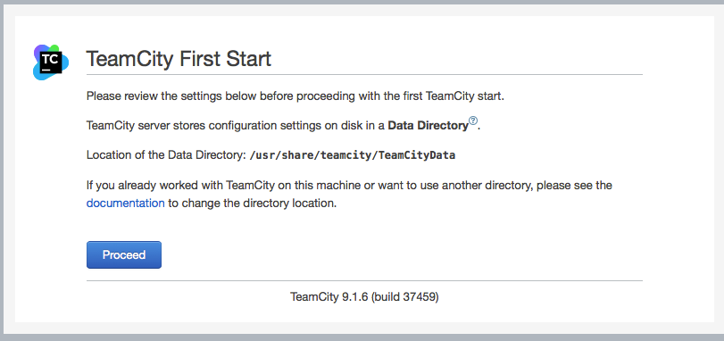
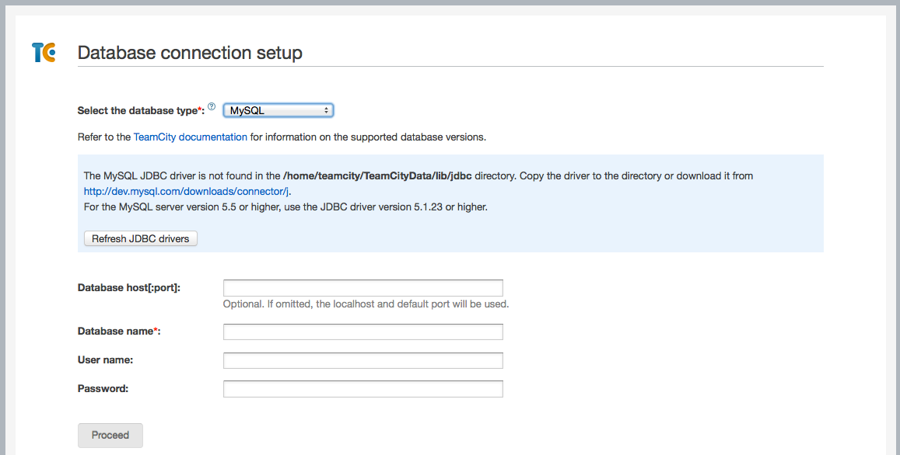
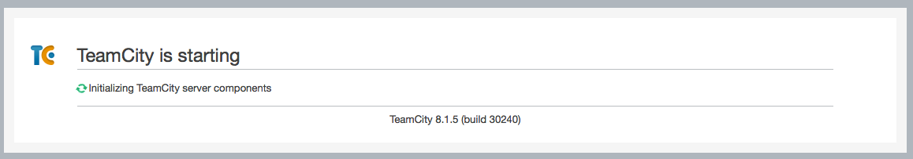

# TeamCity Continuous Integration

This is a role to install and configure TeamCity Continuous Integration inside
the guest VM according to your project standards and needs.

## Instructions

Enable the following roles:

- mysql
- java-oracle or java-open
- teamcity (this role)

and provision the VM as usual. By default, you should get the following welcome
screen at [http://devstack.vm:8111/mnt](http://devstack.vm:8111/mnt):

That is as far as you get automatically. For next steps, see
[Configuration](#configuration), below.

## Variables
teamcity_user: teamcity
teamcity_version: 9.1.6
teamcity_install_path: /usr/share/teamcity

teamcity_tarball: "TeamCity-{{ teamcity_version }}.tar.gz"
teamcity_download_url: "https://download.jetbrains.com/teamcity/{{ teamcity_tarball }}"

## Configuration

Once the application is running, there are some manual steps to create the
required configuration. We may choose to automate this at some point.

Todo: the first screenshot is from a recent install of TeamCity 9.1.6, but the
others have not been updated since a previous install of 8.1.5.

1. Open a web browser on http://devstack.vm:8111.  If the provisioning went well
   (You paid attention to the status messages, didn't you?) you should get a
   welcome screen:  

2. Click `Proceed` and you should get to the first database-setup screen.
   Select `MySQL` from the drop-down list, and you should see something like
   this:  .

3. Click `Refresh JDBC drivers` and the status message should turn happy:
   .  Fill in
   - `Database name`: "devstack"
   - `User name`: "vagrant"
   - `Proceed`: "vagrant"
   Click `Proceed`.

4. You should get a spinning wheel as TeamCity initializes the database:
   .

5. Accept the license agreement, and TeamCity should be ready to roll!

## Author Information

NorthPoint Digital
